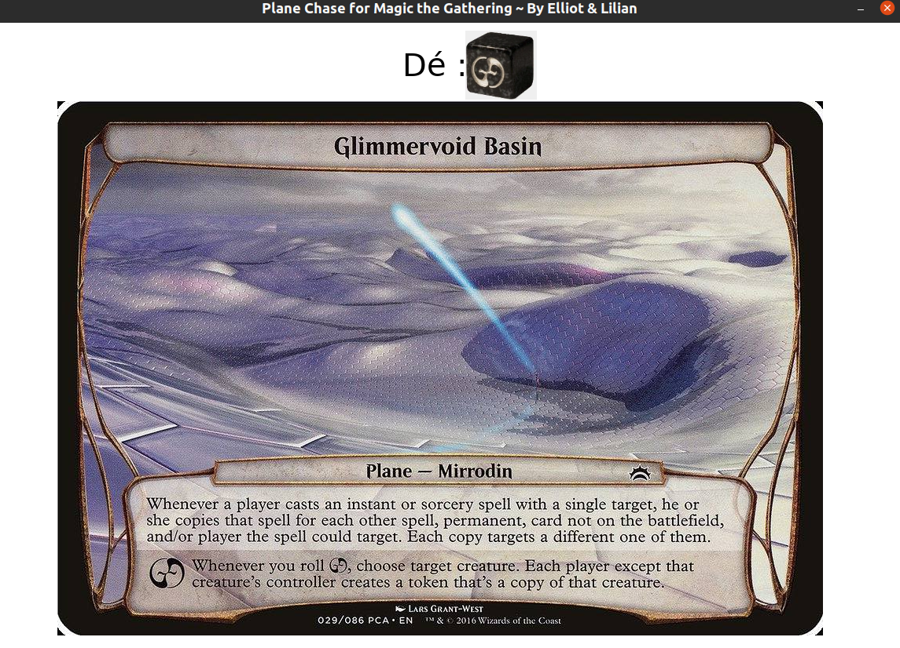
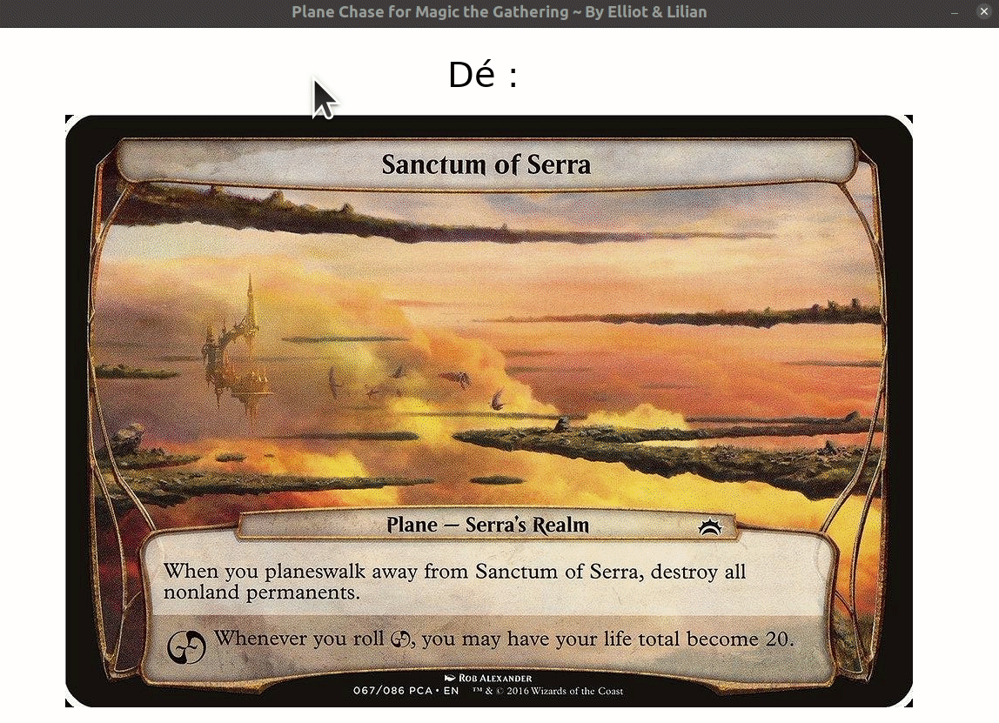
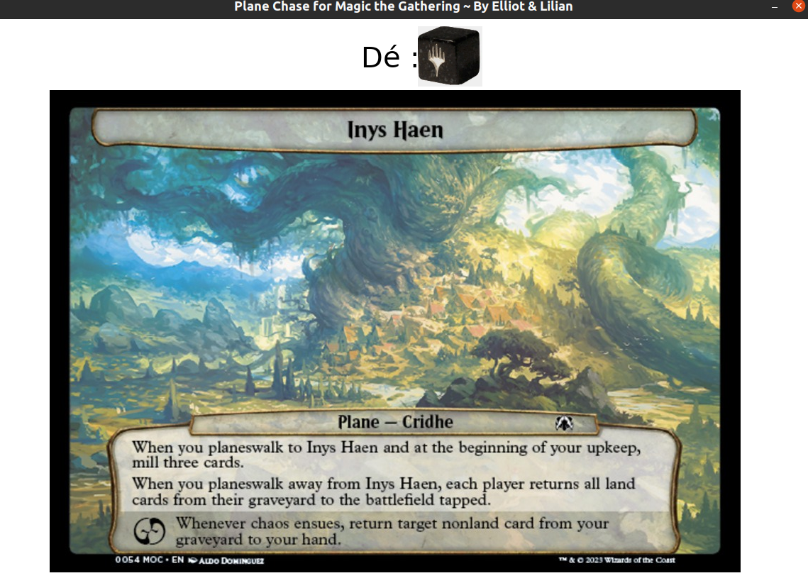

# *Plane Chase for Magic the Gathering* ~ *by Elliot & Lilian*

Un petit simulateur de deck de cartes planaires, pour jouer à la variante « PlaneChase » de Magic the Gathering, écrit en Lua avec le framework Löve2D (<https://love2d.org>).

## De quoi il s'agit ?

- Magic the Gathering est un jeu de cartes à jouer et collectionner. Plus d'informations [ici](https://fr.wikipedia.org/wiki/Magic_:_L'Assembl%C3%A9e) ou [ici en anglais](https://mtg.fandom.com/wiki/Main_Page).

- PlaneChase est une variante, qui utilise un deck supplémentaire de cartes et un dé dits planaires. Plus d'informations [ici](https://www.youtube.com/watch?v=p-mx3WwpjUU), ou [ici en anglais](https://mtg.fandom.com/wiki/Planechase_(format)) ou [cette autre vidéo en anglais](https://www.youtube.com/watch?v=wC98RS2YvJk).

Demo de l'application :

## À propos de ce mini projet

Ce mini projet nous a permis de progresser en Lua et en Löve2D, dans le cadre des ateliers de programmation que [Lilian Besson](https://GitHub.com/Naereen) anime au printemps 2023 à la Ludothèque et au Fablab de Briançon (voir [cette page](https://github.com/aucoindujeu/codeclub)).

==> Jouez ici : <https://naereen.github.io/PlaneChase.lua/www/> en dézoomant assez pour voir en entier les cartes des plans. Transplanez vers le plan suivant avec la touche Droite du clavier, et lancez le dé planaire avec la touche Espace !

----

## Avancement du mini projet

- [x] Premier prototype, qui permet de transplaner vers un nouveau plan aléatoirement choisi parmi les 86 existant.
- [x] Doc à écrire, commentaire dans le code et ce README.
- [x] Tester la version `.love` localement, et la distribuer ici ? (non)
- [x] Produire une mini vidéo de démo de l'appli. Documentation d'utilisation : espace pour jeter le dé planaire (probabilités : 1/6 de chaos planaire, 1/6 de transplaner, 4/6 de ne rien faire), et clavier touche droite pour tranplaner vers le prochain plan ou phénomène planaire.

- [x] Réussir à faire une version web pour "jouer" depuis un navigateur Internet, et l'héberger [ici](https://naereen.github.io/PlaneChase.lua/www/).
- [x] Compléter le [Makefile](Makefile) pour aussi envoyer la version web sur [mon site Internet](https://perso.crans.org/besson/publis/PlaneChase.lua/)

- [x] J'ai récupéré les images des plans de *March of the Machine* commander decks (en `.png`), mais il faut les remettre dans les mêmes dimensions que les autres en `.jpg` !

## Objectifs bonus ?

### Pour faire plaisir à Sam ?

- [ ] Traduire l'appli pour utiliser les images de plans en français ? Malheureusement elles sont en mauvaise qualité, l'appli serait probablement inutilisable...

### Pour apprendre les « GitHub actions » !

- [ ] Configurer une GitHub action pour construire le .love automatiquement et le distribuer ici ? C'est en cours.

- [ ] Configurer une GitHub action pour déployer le jeu dans sa version web (dossier [www/](www/)) à chaque commit, sans avoir à faire de `make build_lovejs` manuellement.

- [ ] Configurer une GitHub action pour construire des "binaires" pour Linux (.AppImage), Mac et Windows, et les distribuer ici ? Ça semble plus dur, mais avec [ces GitHub actions](https://github.com/marketplace/actions/love-actions-for-linux) cela devrait être faisable.

## License ?

[MIT Licensed](LICENSE)
© [Elliot](https://github.com/Elliott005) & Lilian Besson (Naereen), 2023
